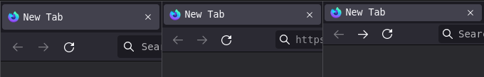
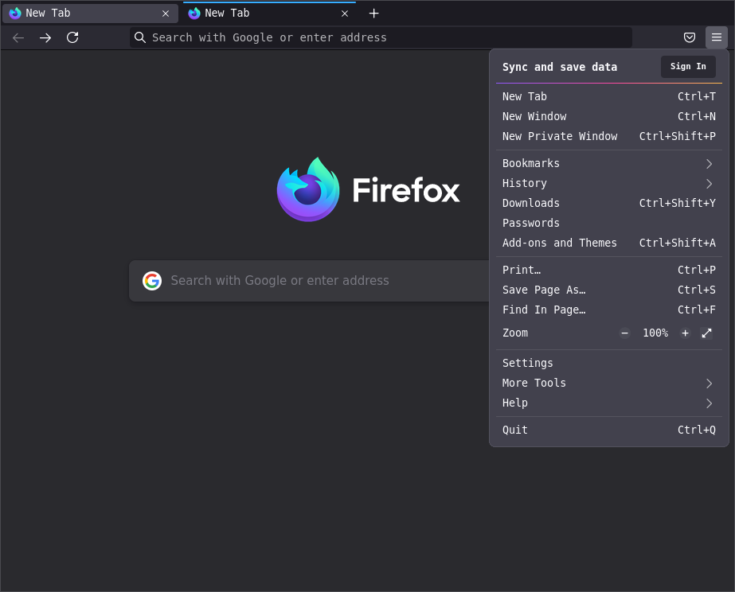
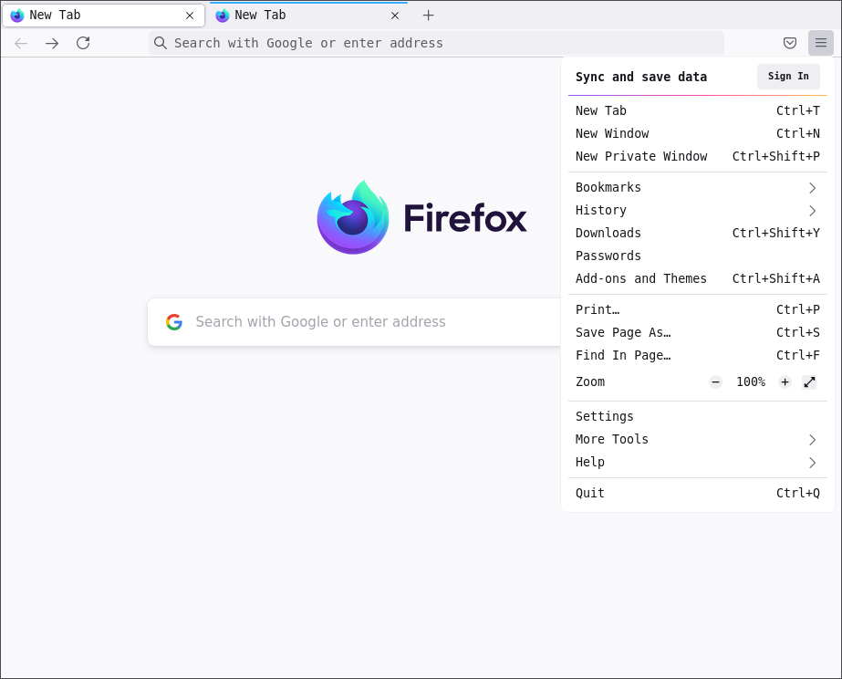

# Firefox Compact Mode

This theme goal is to create a compact mode that follows Firefox 89 (known as
Proton) design system while using the same vertical space as the compact mode in
Firefox 88 (known as Photon).

## Installation

1. Type *about:config* in the address bar and press Enter/Return.
2. Click the button accepting the risk.
3. In the search box above the list, type or paste
   `toolkit.legacyUserProfileCustomizations.stylesheets`.
4. Double-click the `toolkit.legacyUserProfileCustomizations.stylesheets`
   preference to switch the value from false to true.
5. Now, search for `browser.compactmode.show` and set it to `true`.
6. Close *about:config* tab.
7. Open your profile folder (See [How do I find my profile?][profile])
8. Go to *chrome* folder or create it if it doesn't exist
9. Copy/Paste the userChrome.css file from this repository inside the *chrome*
   folder.
10. Enjoy! :)

## Screenshots (Click on the image to enlarge)

Size difference between (from left to right) regular, compact and ultra compact
mode

Dark theme:

Light theme:

[profile]: https://support.mozilla.org/en-US/kb/profiles-where-firefox-stores-user-data#w_how-do-i-find-my-profile
