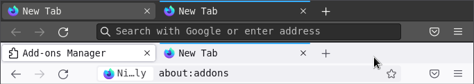
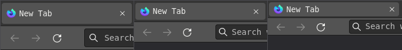

# Firefox Ultra Compact Mode

## Installation

1. Follow the instruction in https://www.userchrome.org/how-create-userchrome-css.html.
2. Open *about:config* and set `browser.compactmode.show` to `true`.

## Screenshots

